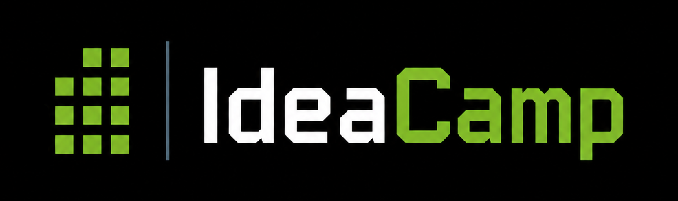

<div align="center">



<br/><br/>

**Eine kollaborative Plattform zum Vorschlagen, Entdecken und Verwalten von Projektideen.**

Entwickelt von Gruppe 3 im Modul *Software Engineering: Realisierung* an der THM (Technische Hochschule Mittelhessen).

[](https://github.com/mlanima/thm-swtp/actions/workflows/ci-backend.yml)
[](https://github.com/mlanima/thm-swtp/actions/workflows/ci-frontend.yml)


</div>

---

## 📑 Inhaltsverzeichnis

- [Über das Projekt](#-über-das-projekt)
- [Tech-Stack](#-tech-stack)
- [Erste Schritte](#-erste-schritte)
  - [Voraussetzungen](#voraussetzungen)
  - [Backend](#backend-api)
  - [Frontend](#frontend-webideacamp)
- [Projektstruktur](#-projektstruktur)
- [Umgebungen](#-umgebungen)
- [Dokumentation](#-dokumentation)
- [Mitwirken](#-mitwirken)
- [Mitwirkende](#-mitwirkende)

## 🎯 Über das Projekt

IdeaCamp ermöglicht es Studierenden und Mitarbeitenden, Projektideen einzureichen, bestehende Ideen zu durchsuchen und gemeinsam daraus echte Projekte zu machen. Authentifizierung und Rollenverwaltung laufen zentral über Keycloak (OAuth2 / OIDC) — und jeder Pull Request bekommt automatisch eine eigene, vollständig deployte Review-Umgebung.

## 🛠 Tech-Stack

| Ebene | Technologie |
|---|---|
| **Backend** | Java 25, Spring Boot (Web, Data JPA, Security), Maven, Checkstyle |
| **Frontend** | Angular 21 (SSR via `@angular/ssr` + Express), TypeScript, Tailwind CSS, Zod, ngx-translate |
| **Auth** | Keycloak (OAuth2 / OIDC), `angular-oauth2-oidc` |
| **Datenbank** | MySQL 9 (Produktion), SQLite (lokale Entwicklung & Tests) |
| **Infrastruktur** | Docker Compose, Traefik (TLS via Let's Encrypt), Babashka-Deploy-Skripte |
| **CI/CD** | GitHub Actions — Build, Lint, Tests, Auto-Deploy & Review-Apps pro PR |

## 🚀 Erste Schritte

### Voraussetzungen

- **Java 25** (Backend)
- **Node.js 20+** mit npm 11+ (Frontend)
- **Docker** (optional, für containerisierte Ausführung)

Repository klonen:

```bash
git clone git@github.com:mlanima/thm-swtp.git
cd thm-swtp
```

### Backend (`api/`)

```bash
cd api
./mvnw spring-boot:run
```

Die API startet unter `http://localhost:8080` mit einer lokalen SQLite-Datenbank. Keycloak (Realm `swtp`) wird unter `https://auth.swtp-ss26.de` erwartet — bei Bedarf in `src/main/resources/application.yaml` anpassen.

<details>
<summary>Alternativ mit Docker starten</summary>

```bash
cd api
docker build -t swtp-api .
docker run -p 8080:8080 -v $(pwd)/db:/app/db swtp-api   # Windows: ${PWD} verwenden
```

</details>

### Frontend (`web/ideacamp/`)

```bash
cd web/ideacamp
npm install
npm start
```

Die App läuft unter `http://localhost:4200` und leitet API-Aufrufe per Proxy an das Backend auf Port 8080 weiter.

Weitere nützliche Skripte:

```bash
npm run build                  # Produktions-Build
npm run serve:ssr:ideacamp     # SSR-Build ausliefern
npm test                       # Unit-Tests (Vitest)
npm run lint                   # ESLint
```

## 📁 Projektstruktur

```
thm-swtp/
├── api/            # Spring-Boot-Backend (REST-API, abgesichert via Keycloak)
├── web/ideacamp/   # Angular-Frontend (SSR)
├── infra/          # Docker-Compose-Stacks, Traefik-Konfiguration, Deploy-Skripte
├── docs/           # Architektur- & Integrationsdokumentation
└── .github/        # CI/CD-Workflows
```

Jedes Teilprojekt hat ein eigenes README mit weiteren Details.

## 🌍 Umgebungen

| Umgebung | Branch | URL |
|---|---|---|
| **Produktion** | `main` | [www.swtp-ss26.de](https://www.swtp-ss26.de) |
| **Entwicklung** | `developer` | [dev.swtp-ss26.de](https://dev.swtp-ss26.de) |
| **Review-Apps** | pro PR | werden automatisch erstellt und beim Schließen abgebaut |
| **Status-Dashboard** | — | [status.swtp-ss26.de](https://status.swtp-ss26.de) |

Pushes auf `main` und `developer` werden automatisch über GitHub Actions deployt. Jeder Pull Request erhält zusätzlich eine eigene isolierte Umgebung (eigenes Datenbank-Schema, eigene Container und Keycloak-Client).

## 📚 Dokumentation

- [Backend-API-Dokumentation](docs/BACKEND_API_DOCUMENTATION.md)
- [Frontend-Struktur & Auth](docs/FRONTEND_STRUCTURE_AND_AUTH.md)
- [Keycloak — Setup & Konfiguration](docs/Keycloak%20-%20Setup%20&%20Konfiguration.md)
- [Rollen & Berechtigungen](docs/ROLLEN.md)
- [Caching](docs/CACHING.md)

## 🤝 Mitwirken

1. Feature-Branch von `developer` erstellen (z. B. `feat/mein-feature`).
2. Änderungen committen — die CI führt bei jedem PR Checkstyle, ESLint, Builds und Tests aus.
3. Pull Request gegen `developer` öffnen. Eine Review-App wird automatisch deployt, sodass Reviewer die Änderungen live ausprobieren können.
4. Review einholen und mergen. 🎉

## 👥 Mitwirkende

<a href="https://github.com/mlanima"></a>
<a href="https://github.com/chrishnz"></a>
<a href="https://github.com/T0SCH"></a>
<a href="https://github.com/dsmk-cpu"></a>
<a href="https://github.com/KSMEHMET42"></a>
<a href="https://github.com/halitcinar"></a>

---

<div align="center">
<sub>THM · Software Engineering: Realisierung · Gruppe 3 · SS26</sub>
</div>
