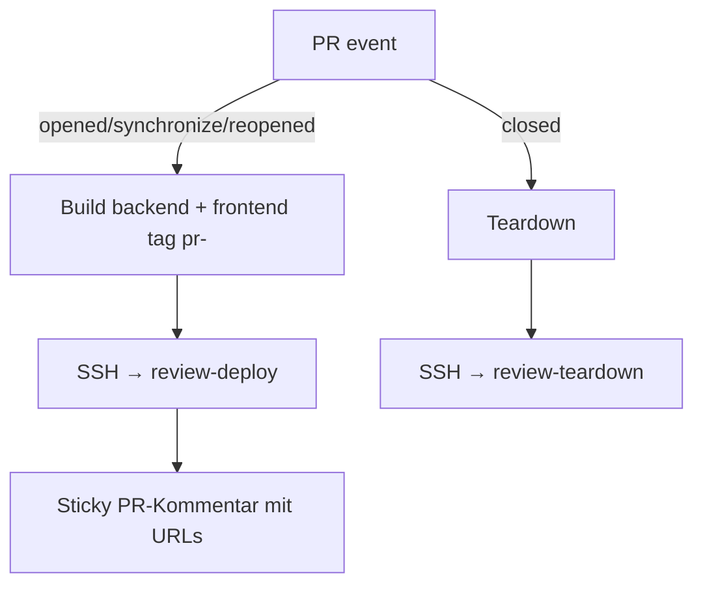
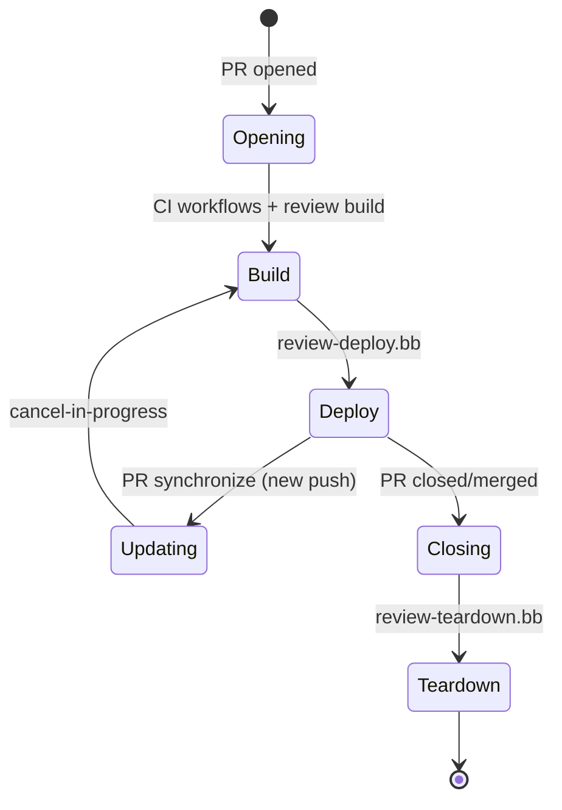
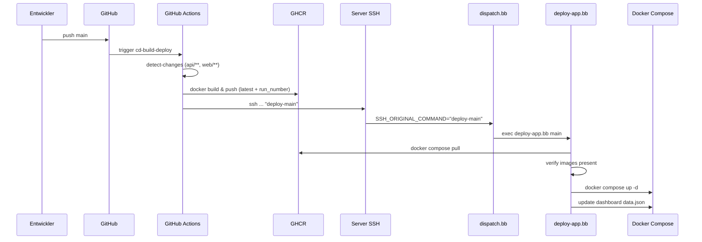
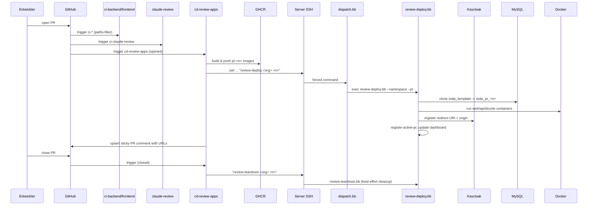
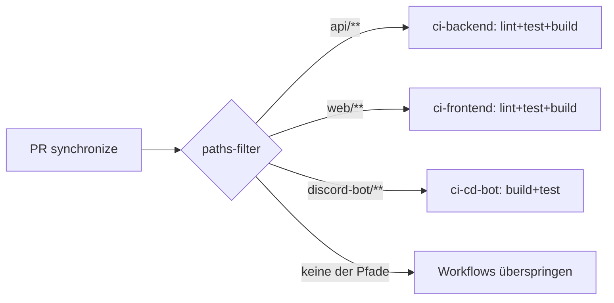

# CI/CD & Deployment-Dokumentation

> Technische Dokumentation der gesamten Build-, Test- und Deployment-Pipeline
> des IdeaCamp-Projekts (THM · Software Engineering: Realisierung · Gruppe 3 · SS26).

Diese Dokumentation beschreibt alle Komponenten, die an der kontinuierlichen
Integration und Auslieferung beteiligt sind: die GitHub-Actions-Workflows, die
Docker-Images und ihre Build-Prozesse, die Container-Stacks auf dem Server, das
Routing über Traefik sowie die serverseitigen Babashka-Deploy-Skripte inklusive
der ephemeren Review-Apps.

---

## Inhaltsverzeichnis

1. [Architekturüberblick](#1-architekturüberblick)
2. [Umgebungen & Branch-Modell](#2-umgebungen--branch-modell)
3. [GitHub-Actions-Workflows](#3-github-actions-workflows)
   - 3.1 [CI Backend (`ci-backend.yml`)](#31-ci-backend-ci-backendyml)
   - 3.2 [CI Frontend (`ci-frontend.yml`)](#32-ci-frontend-ci-frontendyml)
   - 3.3 [CI Discord Bot (`ci-cd-bot.yml`)](#33-ci-discord-bot-ci-cd-botyml)
   - 3.4 [CD Build & Deploy (`cd-build-deploy.yml`)](#34-cd-build--deploy-cd-build-deployyml)
   - 3.5 [CD Review Apps (`cd-review-apps.yml`)](#35-cd-review-apps-cd-review-appsyml)
   - 3.6 [Claude Code Review (`ci-claude-review.yml`)](#36-claude-code-review-ci-claude-reviewyml)
4. [Docker-Images & Dockerfiles](#4-docker-images--dockerfiles)
5. [GHCR & Image-Tagging-Strategie](#5-ghcr--image-tagging-strategie)
6. [Server-Infrastruktur (Docker Compose Stacks)](#6-server-infrastruktur-docker-compose-stacks)
7. [Traefik-Routing & TLS](#7-traefik-routing--tls)
8. [Netzwerk-Topologie](#8-netzwerk-topologie)
9. [Deploy-Mechanismus über SSH](#9-deploy-mechanismus-über-ssh)
10. [Babashka-Deploy-Skripte](#10-babashka-deploy-skripte)
11. [Review-Apps – Lebenszyklus](#11-review-apps--lebenszyklus)
12. [Status-Dashboard](#12-status-dashboard)
13. [Secrets-Management](#13-secrets-management)
14. [Backup-Restart & aktive PRs](#14-backup-restart--aktive-prs)
15. [Sync-Überprüfung & Hilfsskripte](#15-sync-überprüfung--hilfsskripte)
16. [End-to-End-Pipeline-Diagramme](#16-end-to-end-pipeline-diagramme)
17. [Troubleshooting & Operations](#17-troubleshooting--operations)

---

## 1. Architekturüberblick

Die Pipeline besteht aus zwei getrennten Welten, die über SSH als schmalem
Verbindungsglied gekoppelt sind:

- **GitHub-Seite:** GitHub Actions übernimmt Lint, Tests, Image-Builds und
  pusht die fertigen OCI-Images in die GitHub Container Registry (GHCR).
  Am Ende eines Push-/PR-Ereignisses triggert der Workflow per SSH einen
  Deploy-Befehl auf dem Server.
- **Server-Seite:** Ein vServer (`swtp-ss26.de`) hostet alle Dienste als
  Docker-Compose-Stacks hinter einem separaten Traefik-Reverse-Proxy, der TLS
  über Let's-Encrypt-Zertifikate (DNS-Challenge via INWX) terminiert. Die
  Deploy-Logik ist in Babashka-Skripten (Clojure-Dialekt auf der JVM)
  implementiert, die über einen SSH-forced-Command aufgerufen werden.

Zentraler Design-Punkt: **Der Deploy-SSH-Key darf nur eine festgelegte
Allowlist von Kommandos ausführen** (`dispatch.bb` als Forced Command in
`authorized_keys`). GitHub Actions kann also per SSH keine beliebigen
Shell-Befehle absetzen, sondern ausschließlich die freigegebenen
Deploy-Routinen. Das schließt eine Kommando-Injection über
`SSH_ORIGINAL_COMMAND` aus.

```
┌───────────────────────────┐         ┌──────────────────────────────────┐
│   GitHub (Repo + Actions)  │         │   Server swtp-ss26.de            │
│                            │         │                                  │
│  PR / push ─► Workflows    │  SSH    │  Traefik (TLS) ──┐               │
│   ├─ CI: lint/test/build   │ ──────► │  dispatch.bb    │               │
│   ├─ Image build → GHCR   │         │   ├─ deploy-app.bb (main/dev)   │
│   └─ Trigger deploy        │         │   ├─ review-deploy.bb          │
│                            │         │   └─ review-teardown.bb        │
└───────────────────────────┘         │  Docker Compose Stacks:         │
                                      │   swtp-infra / swtp-main /       │
                                      │   swtp-dev / (per-PR)           │
                                      └──────────────────────────────────┘
```

Der Discord-Bot läuft auf einem zweiten Host (`ser.mlanima.org`) und besitzt
ein eigenes Compose-Setup (siehe [§6.4](#64-sermlanimaorg--discord-bot)).

---

## 2. Umgebungen & Branch-Modell

Das Repository verwendet drei持久ente Branches, die jeweils eine Umgebung
abbilden, sowie ephemeral Review-Apps pro Pull Request:

| Umgebung   | Branch      | Image-Tag  | Frontend-URL                  | Backend-URL                             |
|------------|-------------|------------|------------------------------|-----------------------------------------|
| Produktion  | `main`      | `latest`   | `https://www.swtp-ss26.de`    | `https://api.swtp-ss26.de`              |
| Dev        | `developer` | `dev`      | `https://dev.swtp-ss26.de`    | `https://api.dev.swtp-ss26.de`          |
| Review     | pro PR      | `pr-<n>`   | `https://pr-<n>.review.swtp-ss26.de` | `https://pr-<n>-api.review.swtp-ss26.de` |
| Status     | —           | —          | `https://status.swtp-ss26.de` | —                                       |

Branch-Regeln (Konvention):

- PRs richten sich gegen `main` oder `developer`.
- Die CI-Workflows laufen ausschließlich bei PRs und bei Pushes auf
  `main`/`developer` (siehe Triggers der einzelnen Workflows).
- Jeder PR bekommt automatisch eine isolierte Review-Umgebung mit eigener
  Datenbank, eigenen Containern und eigenem Keycloak-Redirect — sie wird beim
  Schließen des PRs wieder abgebaut.

---

## 3. GitHub-Actions-Workflows

Alle Workflows liegen in `.github/workflows/`. Es gibt zwei Kategorien:

- **CI** (`ci-*.yml`): läuft bei Pull Requests und prüft Code-Qualität,
  Tests und Build.
- **CD** (`cd-*.yml`): läuft bei Pushes auf `main`/`developer` (bzw. bei
  PR-Ereignissen für Review-Apps) und baut Images, pushed sie nach GHCR und
  triggert den Server-Deploy.

Zusätzlich existiert der `ci-claude-review.yml`-Workflow, der einen
KI-gestützten Code-Review auf jedem PR ausführt.

### 3.1 CI Backend (`ci-backend.yml`)

**Trigger:** `pull_request` auf `main`/`developer`, eingeschränkt auf Pfade
`api/**` (`paths`-Filter).

**Jobs (parallel, je eigenständiger Runner):**

| Job            | Befehl                                  | Zweck                       |
|----------------|------------------------------------------|-----------------------------|
| `lint-backend` | `./mvnw checkstyle:check`               | Checkstyle-Codeanalyse       |
| `test-backend` | `./mvnw test`                            | Unit-/Integrationstests      |
| `build-backend`| `./mvnw package -DskipTests`            | Compilierbarkeit prüfen     |

Alle Jobs nutzen `actions/setup-java@v5` mit Java 25 (Temurin) und Maven-Cache.
Arbeitsverzeichnis ist `api`. Da die Jobs nicht voneinander abhängen, laufen
sie parallel und verkürzen die PR-Feedback-Zeit.

### 3.2 CI Frontend (`ci-frontend.yml`)

**Trigger:** `pull_request` auf `main`/`developer`, Pfade `web/ideacamp/**`.

**Jobs (parallel):**

| Job             | Befehl              | Zweck                              |
|-----------------|----------------------|------------------------------------|
| `lint-frontend` | `npm run lint`       | ESLint                             |
| `test-frontend` | `npm test`           | Angular-Tests (headless)          |
| `build-frontend`| `npm run build`      | Produktionsbuild prüfen            |

Verwendet `actions/setup-node@v6` mit Node 22 und npm-Cache
(`cache-dependency-path: web/ideacamp/package-lock.json`). Dependencies werden
mit `npm ci` reproduzierbar installiert.

### 3.3 CI Discord Bot (`ci-cd-bot.yml`)

**Trigger:** `pull_request` auf `main`/`developer`, Pfade `discord-bot/**`.

**Job `ci-bot`:** führt `npm ci`, `npm run build` und `npm test` aus
(Node 24). Der Workflow heißt zwar `ci-cd-bot`, enthält aktuell aber nur die
CI-Phase. Die CD für den Bot läuft über den getrennten Host `ser.mlanima.org`
(siehe [§6.4](#64-sermlanimaorg--discord-bot)); die Images `latest`/`dev` werden
dort direkt referenziert. Ein expliziter Image-Build/Push-Workflow für den Bot
existiert nicht — der Bot wird lokal oder manuell gebaut und ins GHCR gepusht.

### 3.4 CD Build & Deploy (`cd-build-deploy.yml`)

**Trigger:** `push` auf `main` oder `developer` sowie `workflow_dispatch`
(manuell). Verantwortlich für Build und Auslieferung der persistenten
Produktions- und Dev-Stacks.

**Permissions:** `contents: read`, `packages: write` (für GHCR-Push).

**Job-Ablauf:**

```mermaid
flowchart TD
  A[push main/developer] --> B[namespace: GHCR-Namespace lower-casen]
  A --> C[detect-changes: paths-filter api/** | web/ideacamp/**]
  C -->|backend geändert| D[build-backend → ghcr.io/.../swtp-api:latest/dev + run_number]
  C -->|frontend geändert| E[build-frontend → ghcr.io/.../swtp-web:latest/dev + run_number]
  D --> F{mindestens ein Build erfolgreich?}
  E --> F
  F -->|ja| G[deploy: SSH → deploy-main / deploy-dev]
  F -->|nein| H[kein Deploy]
```

Details zu den Jobs:

- **`namespace`** ermittelt den GHCR-Namespace aus `github.repository_owner`
  und wandelt ihn in Kleinbuchstaben um (GHCR verlangt lowercase Namen).
- **`detect-changes`** nutzt `dorny/paths-filter@v4` mit `base:
  github.ref_name`, um festzustellen, ob sich Backend- bzw. Frontend-Code
  geändert hat. Nur geänderte Komponenten werden neu gebaut.
- **`build-backend` / `build-frontend`** nutzen
  `docker/setup-buildx-action@v4` und `docker/build-push-action@v7` mit
  BuildKit. Es werden **zwei Tags** gepusht:
  - ein semantischer Tag (`latest` für `main`, `dev` für `developer`),
  - die Build-Nummer `github.run_number` (für Nachvollziehbarkeit/Rollbacks).
  Das Frontend erhält zusätzlich den Build-Arg `API_URL` (umgebungsabhängig)
  sowie das Secret `google-maps-api-key`.
- **`deploy`** triggert den Server-Deploy. Die `if`-Bedingung
  `always() && (build-backend.result == 'success' || build-frontend.result == 'success')`
  stellt sicher, dass der Deploy läuft, sobald mindestens ein Build
  erfolgreich war — auch wenn der andere wegen “keine Änderungen” übersprungen
  wurde. Über eine `case`-Anweisung wird `github.ref_name` auf das SSH-Kommando
  abgebildet: `main → deploy-main`, `developer → deploy-dev`. Andere Branches
  führen zu einem Hard-Fail (`exit 1`).
- **SSH-Verbindung:** Der private Schlüssel liegt im Secret
  `DEPLOY_SSH_KEY`. Verbindungsaufbau:
  ```
  ssh -o StrictHostKeyChecking=no -i ~/.ssh/deploy_key -p 2105 \
      tosch@mail.schalz.de "<command>"
  ```
  Der Port 2105 und der Forced Command sorgen dafür, dass nur die
  Allowlist-Skripte ausgeführt werden können (siehe [§9](#9-deploy-mechanismus-über-ssh)).

### 3.5 CD Review Apps (`cd-review-apps.yml`)

**Trigger:** `pull_request` auf `main`/`developer`, Typen
`opened, synchronize, reopened, closed`.

**Permissions:** `contents: read`, `packages: write`, `pull-requests: write`
(für den PR-Kommentar).

**Concurrency:** `group: review-pr-<PR-Nummer>, cancel-in-progress: true` —
neue Pushes auf denselben PR canceln laufende Builds, da Review-Apps nur den
jeweils aktuellen Stand repräsentieren müssen.

**Ablauf:**



Besonderheiten:

- **Change Detection (`detect-changes`)** läuft nur, wenn die Action nicht
  `closed` ist.
- **Build-Jobs:** Sowohl `build-backend` als auch `build-frontend` laufen,
  sobald **entweder** Backend **oder** Frontend geändert wurde
  (`if: backend == 'true' || frontend == 'true'`). Grund: ein Review-Stack
  besteht immer aus beiden Containern, auch wenn nur eine Komponente neu gebaut
  wurde; die andere wird mit dem letzten PR-Tag neu gepullt. Das Frontend-Build
  bekommt `API_URL=https://pr-<n>-api.review.swtp-ss26.de/api` injiziert.
- **`deploy-review`** triggert per SSH
  `review-deploy <namespace> <PR-Nummer>`. Danach wird mit
  `actions/github-script@v9` ein **sticky PR-Kommentar** erzeugt bzw.
  aktualisiert: der Bot sucht nach seinem eigenen vorhandenen Kommentar mit der
  Überschrift `## 🚀 Review App` und aktualisiert diesen (`updateComment`),
  statt neue Kommentare aufzuhäufen. Der Kommentar enthält Links zu Frontend,
  Backend, Logs (Dozzle) und Dashboard mit Zeitstempel (Europe/Berlin).
- **`teardown-review`** läuft nur bei `closed` und ruft per SSH
  `review-teardown <namespace> <PR-Nummer>` auf. Er benötigt nur den
  `namespace`-Job, keine Builds.

### 3.6 Claude Code Review (`ci-claude-review.yml`)

**Trigger:** `pull_request` (Typen `opened, synchronize, reopened`) auf
`main`/`developer`.

**Concurrency:** `claude-review-<PR-Nummer>`, `cancel-in-progress: true`.

**Job `claude-review`** nutzt die Action `anthropics/claude-code-action@v1`
mit dem Secret `CLAUDE_CODE_OAUTH_TOKEN` und dem erlaubten Werkzeugsatz
`Write,Read,Glob,Grep,Bash`. Der Prompt instruiert das Modell:

- Review des PR-Diffs mit Fokus auf Codequalität, Bugs, Sicherheit,
  Konsistenz.
- Ausgabe **ausschließlich** als Datei `review.md` im Repo-Root (keine
  Chat-Antwort, keine Inline-Kommentare).
- Severity-Ampel (`🔴🟠🟡⚪🟢`) in einer Markdown-Tabelle mit
  Permalinks auf die exakte Zeile (`HEAD_SHA`).
- Review-Text auf Deutsch, Code-Bezeichner englisch.

Nach dem Claude-Schritt folgt **`Publish sticky review comment`**: ein
Bash-Schritt mit `MARKER="<!-- claude-sticky-review -->"` sucht per
`gh api` den eigenen Bot-Kommentar mit dem Marker und patcht ihn (`PATCH`)
oder legt ihn neu an (`POST`). So entsteht ein einzelner, immer aktueller
Review-Kommentar pro PR, statt vieler einzelner.

Abschließend prüft **`Fail if no review was produced`**, dass `review.md`
existiert. Fehlt sie (abgebrochener/fehlgeschlagener Review), färbt sich der
Job rot statt still mit dem Fallback-Kommentar durchzurutschen.
`!cancelled()` stellt sicher, dass ein durch neuen Push abgebrochener Lauf
nicht fälschlich als Fehler zählt.

---

## 4. Docker-Images & Dockerfiles

Alle drei Komponenten besitzen mehrstufige Dockerfiles (Build-Stage +
Runtime-Stage), die darauf optimiert sind, kleine Runtime-Images ohne
Build-Tooling zu erzeugen.

### 4.1 Backend (`api/Dockerfile`)

Drei Stages:

1. **`builder`** (`eclipse-temurin:25-jdk-alpine`): lädt erst
   `.mvn/`, `mvnw`, `pom.xml` und führt `dependency:go-offline` aus, um den
   Dependency-Layer zu cachen. Erst danach wird `src/` kopiert und
   `./mvnw package -DskipTests` ausgeführt.
2. **`extractor`**: extrahiert die Spring-Boot-Layer
   (`java -Djarmode=layertools -jar ... extract`), damit Docker die Layer
   separat cachen kann (Dependencies, Loader, Snapshot-Dependencies,
   Application).
3. **Runtime** (`eclipse-temurin:25-jre-alpine`): legt einen nicht-privilegierten
   User `app` an, kopiert die Layer in der richtigen Reihenfolge und startet
   über `org.springframework.boot.loader.launch.JarLauncher`. Healthcheck:
   `GET /actuator/health` alle 30 s.

### 4.2 Frontend (`web/ideacamp/Dockerfile`)

Zwei Stages:

1. **`builder`** (`node:24-alpine`): nimmt den Build-Arg `API_URL` und das
   Build-Secret `google-maps-api-key` entgegen. Per `sed` werden die
   Platzhalter `__API_URL__` und `__GOOGLE_MAPS_API_KEY__` in
   `enviroments/enviroment.prod.ts` ersetzt — so wird die API-URL zur Build-Zeit
   gebacken und gelangt nicht als Layer-History-Secret ins Image. Anschließend
   `npm run build -- --configuration=production`.
2. **Runtime** (`node:24-alpine`): nur das Build-Artifact
   `dist/ideacamp` wird kopiert. User `app`, Healthcheck `GET /health` auf
   Port 4000. `CMD ["node", "dist/ideacamp/server/server.mjs"]` startet die
   Angular-SSR-App.

### 4.3 Discord Bot (`discord-bot/Dockerfile`)

Zwei Stages: `builder` baut TypeScript (`npm run build`), `runtime` kopiert
nur `dist/`, installiert Produktions-Dependencies (`npm ci --omit=dev`) und
startet `node dist/index.js`. Healthcheck `GET /health` auf Port 3001.

---

## 5. GHCR & Image-Tagging-Strategie

Alle Images liegen in der GitHub Container Registry unter
`ghcr.io/<owner-lowercase>/...`. Der Namespace wird in jedem CD-Workflow
dynamisch über den `namespace`-Job aus `github.repository_owner` in
Kleinbuchstaben berechnet, damit das Repo auch nach Forks/Ownership-Wechseln
funktioniert.

| Image                  | Tags                                            | Verwendung           |
|------------------------|-------------------------------------------------|----------------------|
| `swtp-api`             | `latest` (main), `dev` (developer), `pr-<n>`, `run_number` | Backend-API  |
| `swtp-web`             | `latest`, `dev`, `pr-<n>`, `run_number`         | Frontend (SSR)       |
| `swtp-bot`             | `latest`, `dev`                                 | Discord-Bot          |

Authentifizierung am GHCR erfolgt über den automatisch verfügbaren
`GITHUB_TOKEN` (`docker/login-action@v4` mit `username: github.actor`,
`password: GITHUB_TOKEN`). Die `packages: write`-Berechtigung wird im
Workflow explizit gesetzt.

Die Build-Nummer (`github.run_number`) als zusätzlicher Tag ermöglicht
gezielte Rollbacks auf einen konkreten Build.

---

## 6. Server-Infrastruktur (Docker Compose Stacks)

Die Stacks liegen im Repo unter `infra/swtp-ss26.de/stacks/` und spiegeln
die Verzeichnisstruktur auf dem Server unter `/opt/stacks/` wider. Es gibt
drei persistente Stacks plus dynamische Review-Apps.

### 6.1 `swtp-infra/` – Shared Infrastruktur

Läuft dauerhaft und stellt Dienste bereit, die von allen Umgebungen geteilt
werden:

| Service        | Image                          | Aufgabe                                         |
|----------------|--------------------------------|-------------------------------------------------|
| `swtp-db`      | `mysql:9`                      | Zentrale MySQL-Instanz mit allen Schemas         |
| `keycloak`     | `quay.io/keycloak/keycloak:26.2` | Auth (OAuth2/OIDC), Realm `swtp`              |
| `keycloak-db`  | `postgres:17-alpine`            | Keycloaks eigener Datenbankspeicher             |
| `hoppscotch-aio` | `hoppscotch/hoppscotch`       | REST-Client (inkl. eigener PG-DB `hoppscotch-db`)|
| `maildev`      | `maildev/maildev`               | SMTP-Dummy für alle Stacks                       |
| `dashboard`    | `nginx:alpine`                 | Statische Status-Seite (`status.swtp-ss26.de`)  |

Keycloak ist über Traefik unter `auth.swtp-ss26.de` erreichbar und wird mit
`KC_PROXY_HEADERS=xforwarded` hinter Traefik betrieben. Die
Keycloak-Themes liegen im Volume `./keycloak-themes` (read-only).

MySQL lauscht nur auf `127.0.0.1:3306` und ist über die Netzwerke
`app_internal` und `review_net` für App- und Review-Container erreichbar.

**Redis** ist im Compose-File als Dienst deklariert, aber auskommentiert.
Die App nutzt stattdessen eine externe Redis-Instanz unter
`redis.ser.mlanima.org` (konfigurierbar via `SPRING_DATA_REDIS_HOST`).

### 6.2 `swtp-main/` – Produktionsstack

Enthält drei Services:

- **`swtp-main-api`** (`swtp-api:latest`) — verbindet sich gegen das Schema
  `swtp_main`, lädt uploads aus einem Volume, schickt Mails an `maildev`,
  deaktiviert Swagger-UI in Prod (`SPRINGDOC_SWAGGERUI_ENABLED=false`).
  Umgebungsvariablen steuern Discord- und GitHub-OAuth, OpenAI-API-Key und
  die Frontend-URL.
- **`swtp-main-web`** (`swtp-web:latest`) — reiner SSR-Container, keine
  eigenen Env-Vars (API-URL ist zur Build-Zeit gebacken).
- **`swtp-main-dozzle`** — Dozzle-Log-Viewer mit Filtern auf die
  Produktions-Container; erreichbar unter `logs.swtp-ss26.de`.

### 6.3 `swtp-dev/` – Dev-Stack

Analog zum Main-Stack, jedoch:

- Schema `swtp_dev`, Image-Tag `dev`.
- `BE_LOG_LEVEL=DEBUG`, Swagger-UI aktiv (sichtbar im Dashboard).
- Frontend `dev.swtp-ss26.de`, Backend `api.dev.swtp-ss26.de`.
- Dozzle filtert nur auf `swtp-dev`-Container.

### 6.4 `ser.mlanima.org/` – Discord Bot

Auf einem zweiten Host läuft `infra/ser.mlanima.org/discord-bot/docker-compose.yml`
mit zwei Services:

- **`discord-bot-main`** (Image `swtp-bot:latest`, Port `3001:3001`, env
  `.env.main`)
- **`discord-bot-dev`** (Image `swtp-bot:dev`, Port `3002:3001`, env `.env.dev`)

Beide nutzen ein internes Bridge-Netzwerk `bot_internal`. Die Env-Files
enthalten `DISCORD_TOKEN`, `REDIS_HOST`, `REDIS_PORT`,
`PLATFORM_API_SECRET` und `PORT`. Das Backend spricht den Bot über
`DISCORD_BOT_BASEURL=http://discord.ser.mlanima.org:3001` an.

### 6.5 Review-Apps (dynamisch, ohne Compose-File)

Review-Apps werden nicht über ein Compose-File im Repo, sondern zur Laufzeit
von `review-deploy.bb` über direkte `docker run`-Aufrufe gestartet (siehe
[§10.4](#104-review-deploybb) und [§11](#11-review-apps--lebenszyklus)).
Das hält den Repo sauber und vermeidet Template-Frickeln für variable
Containernamen.

---

## 7. Traefik-Routing & TLS

Traefik läuft separat auf dem Host (nicht Teil der Compose-Stacks) und ist
an das externe Docker-Netzwerk `traefik-net` angebunden. Jeder Service
registriert sich über Docker-Labels bei Traefik:

Beispiel (Frontend Prod):

```yaml
labels:
  - traefik.enable=true
  - traefik.docker.network=traefik-net
  - traefik.http.routers.swtp-main-web.rule=Host(`www.swtp-ss26.de`)
  - traefik.http.routers.swtp-main-web.entrypoints=websecure
  - traefik.http.routers.swtp-main-web.tls.certresolver=letsencrypt-inwx
  - traefik.http.routers.swtp-main-web.service=swtp-main-web
  - traefik.http.services.swtp-main-web.loadbalancer.server.port=4000
```

TLS wird über Let's Encrypt mit **DNS-Challenge via INWX** bezogen
(`certresolver=letsencrypt-inwx`). Dadurch können auch Wildcard-Zertifikate
für die dynamischen Review-Subdomains `*.review.swtp-ss26.de` ausgestellt
werden — `review-deploy.bb` setzt pro Container
`traefik.http.routers.<name>.tls.domains[0].main=*.review.swtp-ss26.de`,
sodass ein einziges Wildcard-Zertifikat alle Review-Apps abdeckt.

Alle öffentlichen Routen nutzen den Entrypoint `websecure` (HTTPS). HTTP
wird auf dem Host durch Traefik auf HTTPS umgeleitet (Host-Konfig, nicht
im Repo).

---

## 8. Netzwerk-Topologie

Die Stacks teilen sich ein Set von Docker-Netzwerken, die das Routing und
die Isolation steuern:

| Netzwerk         | Typ       | Zweck                                                |
|------------------|-----------|------------------------------------------------------|
| `traefik-net`    | extern    | Traefik ↔ alle öffentlich erreichbaren Container      |
| `app_internal`   | extern    | App-Container ↔ zentrale Dienste (MySQL, Maildev)   |
| `review_net`     | extern    | Review-Container ↔ MySQL/Maildev (isoliert von App) |
| `keycloak_internal` | bridge | Keycloak ↔ keycloak-db (nur intern)                  |
| `hopp_internal`  | bridge    | Hoppscotch ↔ hoppscotch-db                           |
| `bot_internal`   | bridge    | discord-bot-main ↔ discord-bot-dev                   |

`swtp-db` hängt an `app_internal` und `review_net`, sodass sowohl
`swtp-main`/`swtp-dev` als auch die dynamischen Review-Container auf
dieselbe MySQL-Instanz zugreifen können — über separate Schemas.

---

## 9. Deploy-Mechanismus über SSH

GitHub Actions führt keine Deploy-Befehle direkt auf dem Server aus.
Stattdessen etabliert es eine SSH-Verbindung und sendet ein einzelnes,
vordefiniertes Kommando. Auf dem Server ist der öffentliche Schlüssel des
`DEPLOY_SSH_KEY`-Secrets in `~/.ssh/authorized_keys` mit einem **Forced
Command** hinterlegt:

```
command="/opt/stacks/swtp-infra/dispatch.bb" ssh-ed25519 AAAA...
```

Das bedeutet: **unabhängig vom übergebenen Kommando wird immer `dispatch.bb`
gestartet.** Das übergebene Kommando steht in `SSH_ORIGINAL_COMMAND` und wird
von `dispatch.bb` ausgewertet.

**Allowlist der Dispatch-Routen** (siehe `dispatch.bb`):

| `SSH_ORIGINAL_COMMAND`                | führt aus                          |
|----------------------------------------|------------------------------------|
| *(leer)* oder `deploy-dev`             | `deploy-app.bb dev`                |
| `deploy-main`                          | `deploy-app.bb main`               |
| `review-deploy <namespace> <pr>`      | `review-deploy.bb --namespace … --pr …` |
| `review-teardown <namespace> <pr>`     | `review-teardown.bb --namespace … --pr …` |
| alles andere                           | abgewiesen + Audit-Log-Eintrag     |

Eigenschaften des Dispatchers:

- **Argumentvalidierung:** `review-args` prüft, dass `<namespace>` dem Regex
  `[A-Za-z0-9._-]+` und `<pr>` dem Regex `\d+` entspricht; zusätzliche Tokens
  führen zu einem Fehler. Damit ist Kommando-Injection über die PR-Nummer
  oder den Namespace ausgeschlossen.
- **Audit-Logging:** Jeder Dispatch (auch abgewiesene) wird mit Zeitstempel
  in `/opt/stacks/swtp-infra/deploy.log` geschrieben. Ein fehlschlagender
  Audit-Schreibvorgang blockiert den Dispatch nicht (`catch Exception _ nil`).
- **Prozess-Ersetzung:** `apply exec program args` ersetzt den aktuellen
  Prozess durch das Zielskript (kein Subshell-Wrapping).

---

## 10. Babashka-Deploy-Skripte

[Babashka](https://github.com/babashka/babashka) ist ein nativer
Clojure-Interpreter auf der JVM, der die Skripte ohne JVM-Start-Overhead
ausführt. Alle `.bb`-Skripte liegen in
`infra/swtp-ss26.de/stacks/swtp-infra/` und werden über ihren Shebang
`#!/usr/bin/env bb` direkt ausgeführt.

### 10.1 `dispatch.bb`

Forced-Command-Router (siehe [§9](#9-deploy-mechanismus-über-ssh)). Liest
`SSH_ORIGINAL_COMMAND`, mapped es auf ein Zielskript und `exec`-t dieses.

### 10.2 `deploy.bb`

Startet den Shared-Infra-Stack (`swtp-infra`): führt
`docker compose -f docker-compose.yml up -d` aus und schreibt
Audit-Logs. Wird manuell aufgerufen (nicht durch GitHub Actions).

### 10.3 `deploy-app.bb`

Zuständig für Pull-and-Restart der App-Stacks `swtp-main` oder `swtp-dev`.

Ablauf:

1. **Konfiguration auflösen** — anhand des Stack-Arguments (`main`/`dev`)
   werden Tag (`latest`/`dev`), Dashboard-URLs und Servicenamen ausgewählt.
2. **`docker compose pull`** — neue Images ziehen. Fehler werden nur
   gewarnt, nicht abgebrochen (Pull kann fehlschlagen, wenn es nichts Neues
   gibt).
3. **Image-Verifikation** — bevor die laufenden Container berührt werden,
   prüft `image-present?` für jeden Service per `docker image inspect`, ob
   das Image lokal verfügbar ist. Fehlt ein Image (z. B. weil der Pull
   fehlschlug und noch keines vorhanden ist), wird **hart abgebrochen**,
   damit kein veralteter oder fehlender Container startet.
4. **`docker compose up -d`** — Services neu starten mit den neuen Images.
5. **Dashboard aktualisieren** — der Stack-Eintrag in
`/opt/stacks/swtp-infra/dashboard/data.json` wird mit `updated_at`-Zeitstempel
überschrieben (pretty-printed JSON).

Jeder Schritt loggt nach `deploy.log`.

### 10.4 `review-deploy.bb`

Orchestriert das Hochfahren einer PR-Umgebung. Aufgerufen als
`review-deploy.bb --namespace <org> --pr <n>`. Das Skript ist im Repo in
zwei Varianten vorhanden: `review-deploy.bb` (vom Dispatcher verwendet) und
`review-deploy-server.bb` (serverseitige Variante mit zusätzlicher
OPENAI-Übergabe). Beide teilen sich die Grundstruktur.

Pipeline (in `-main`):

1. **Argumente parsen** (`parse-args`) und dynamisches `*pr-num*` binden.
2. **`.env` laden** (`load-env!`) — Wurzel für DB-Root-Passwort,
   Keycloak-Admin, ggf. OpenAI-Key.
3. **DB klonen** (`clone-db!`) — `swtp_template → swtp_pr_<n>` per
   `CREATE DATABASE` + `GRANT` + `mysqldump | mysql`. MySQL kennt kein
   `CREATE DATABASE ... LIKE WITH DATA`, deshalb Dump+Restore.
4. **Frontend-Container starten** (`deploy-web`) — Image
   `ghcr.io/<org>/swtp-web:pr-<n>`, Traefik-Labels für
   `pr-<n>.review.swtp-ss26.de`, Port 4000.
5. **Backend-Container starten** (`deploy-api`) — zusätzlich auf
   `review_net`, mit `review.env` als env-file, per-PR Upload-Verzeichnis
   (gemountet nach `/app/uploads`), eigener `SPRING_DATASOURCE_URL`,
   per-PR `APP_FRONTEND_URL`, `GITHUB_OAUTH_REDIRECT_URI` und
   `DISCORD_REDIRECT_URI`. GitHub-OAuth-Client/Secret/Encryption-Key kommen
   aus dem shared `review.env` (Integration self-disables, siehe
   [§13](#13-secrets-management)).
6. **Upload-Verzeichnis provisionieren** (`provision-upload-dir!`) — kopiert
   `/opt/stacks/swtp-infra/uploads/template` nach `uploads/pr-<n>` und
   chowned auf `100:101` (App-UID/GID im Container).
7. **Dozzle-Container starten** (`deploy-dozzle`) — Log-Viewer gefiltert auf
   das Label `pr=<n>`, erreichbar unter `pr-<n>-logs.review.swtp-ss26.de`.
8. **Keycloak-Redirect registrieren** (`add-pr-redirect!`) — da Keycloak
   keine Subdomain-Wildcards unterstützt, wird pro PR die Redirect-URI
   `https://pr-<n>.review.swtp-ss26.de/*` und die Web-Origin per Admin
   REST API am Client `swtp-frontend` (Realm `swtp`) ergänzt. Auth via
   Password-Grant am `admin-cli`.
9. **`active-prs.txt` pflegen** (`register-active-pr!`) — Eintrag `pr-<n>`,
   damit der Backup-Restart die Review-App nach einem Backup-Zyklus wieder
   hochfährt (siehe [§14](#14-backup-restart--aktive-prs)).
10. **Dashboard aktualisieren** (`register-dashboard!`) — schreibt
    Frontend-/Backend-/Logs-/PR-URL (und ggf. PR-Titel via GitHub-API) nach
    `dashboard/data.json`.

Alle Schritte loggen mit `[PR-<n>]`-Präfix. Fehler werfen `ex-info` und
beenden mit Exit-Code 1.

### 10.5 `review-teardown.bb`

Best-Effort-Abbau einer PR-Umgebung. Jeder Schritt ist in ein `attempt`
gewrappt, sodass ein Fehler in einem Schritt die anderen nicht blockiert.
Das `.env` wird **lazy** geladen (`delay`), damit Container-/Image-/File-Cleanup
auch ohne `.env` durchlaufen (nur DB-Drop und Keycloak brauchen Credentials).

Schritte:

1. Container `swtp-web-pr-<n>`, `swtp-api-pr-<n>`, `swtp-logs-pr-<n>` per
   `docker rm -f` entfernen (nicht vorhandene werden still akzeptiert).
2. Images `ghcr.io/<org>/swtp-web:pr-<n>` und `swtp-api:pr-<n>` entfernen
   (`docker rmi`, best-effort) — gibt Plattenplatz frei.
3. Datenbank `swtp_pr_<n>` droppen (`DROP DATABASE IF EXISTS`).
4. Upload-Verzeichnis `uploads/pr-<n>` rekursiv löschen.
5. Redirect-URI und Web-Origin aus dem Keycloak-Client entfernen.
6. Eintrag aus `active-prs.txt` streichen.
7. PR-Eintrag aus `dashboard/data.json` entfernen.

---

## 11. Review-Apps – Lebenszyklus



Eine Review-App umfasst pro PR:

- **Datenbank** `swtp_pr_<n>` (Klon von `swtp_template`)
- **Upload-Verzeichnis** `uploads/pr-<n>`
- **Container** `swtp-web-pr-<n>`, `swtp-api-pr-<n>`, `swtp-logs-pr-<n>`
- **Traefik-Routen** mit Wildcard-Zertifikat `*.review.swtp-ss26.de`
- **Keycloak-Client-Eintrag** (Redirect-URI + Web-Origin)
- **Dashboard-Eintrag** unter `prs.<n>`
- **`active-prs.txt`-Eintrag** für Backup-Restart

URLs:

| Service  | URL                                            |
|----------|------------------------------------------------|
| Frontend | `https://pr-<n>.review.swtp-ss26.de`            |
| Backend  | `https://pr-<n>-api.review.swtp-ss26.de`        |
| Logs     | `https://pr-<n>-logs.review.swtp-ss26.de`       |
| Swagger  | `https://pr-<n>-api.review.swtp-ss26.de/swagger-ui/index.html` |

Die Container tragen das Docker-Label `pr=<n>`, anhand dessen Dozzle
filtert und ggf. Skripte sie identifizieren können.

---

## 12. Status-Dashboard

`status.swtp-ss26.de` wird als statische Seite über einen `nginx:alpine`-
Container aus `swtp-infra/dashboard/` ausgeliefert.

- **`index.html`** — reine SPA (kein Build-Step): holt alle 60 s
  `data.json?_=<timestamp>` (Cache-Busting), rendert Karten für `main`,
  `dev` und alle `prs`, und setzt dynamisch ein Favicon mit der Anzahl
  aktiver Review-Apps. Unterstützt Dark/Light-Modus via
  `prefers-color-scheme`.
- **`data.json`** — wird zur Laufzeit von den Deploy-Skripten geschrieben
  (`deploy-app.bb` für `main`/`dev`, `review-deploy.bb` /
  `review-teardown.bb` für PRs). Die Datei ist in `.gitignore`-Sinne
  runtime-only und wird nicht versioniert gepflegt.

Schema (vereinfacht):

```json
{
  "main": { "fe": "...", "keycloak": "...", "logs": "...", "updated_at": "..." },
  "dev":  { "fe": "...", "be": "...",   "logs": "...", "updated_at": "..." },
  "prs":  { "6": { "fe": "...", "be": "...", "logs": "...", "pr_url": "...", "pr_title": "..." } }
}
```

---

## 13. Secrets-Management

Secrets liegen an drei Orten, sauber getrennt:

### 13.1 GitHub Secrets (für Actions)

| Secret                     | Verwendung                                          |
|----------------------------|-----------------------------------------------------|
| `DEPLOY_SSH_KEY`           | Privater SSH-Schlüssel für den Server-Deploy        |
| `GOOGLE_MAPS_API_KEY`      | Build-Secret fürs Frontend-Image                    |
| `CLAUDE_CODE_OAUTH_TOKEN`  | OAuth-Token für `claude-code-action`               |
| `GITHUB_TOKEN`             | automatisch, für GHCR-Push und PR-Kommentare        |

Die Docker-Logins nutzen den automatischen `GITHUB_TOKEN`; für den Deploy
kommen keine zusätzlichen Registry-Credentials auf den Server, da der Server
als anonymer Puller konfiguriert ist bzw. die Images öffentlich lesbar sind.

### 13.2 Server-`.env` (nicht im Repo)

Jeder Stack hat eine `.env` (basierend auf `.env.example`), die auf dem
Server unter `/opt/stacks/<stack>/.env` liegt:

- **`swtp-infra/.env`** — MySQL-Root-Passwort, MySQL-User/Passwort,
  Keycloak-Admin, KC-DB-Credentials, Hoppscotch-Credentials und Mailer-Setup.
- **`swtp-main/.env`** / **`swtp-dev/.env`** — MySQL-User/Passwort,
  GHCR-Namespace, OpenAI-Key, Google-API-Key, Redis-Host, Discord- und
  GitHub-OAuth-Credentials, `GITHUB_TOKEN_ENCRYPTION_KEY`.
- **`swtp-infra/review.env`** — gemeinsame Konfig für alle Review-Apps
  (shared Credentials). GitHub-OAuth ist hier **leer** — die Integration
  self-disabled (Connect/Link-Endpoints antworten 503), weil Review-Apps
  dynamische Hostnames haben, für die keine einzelne OAuth-App
  registriert werden kann.

### 13.3 Discord-Bot-`.env`

`ser.mlanima.org/discord-bot/.env.main` bzw. `.env.dev` enthalten
`DISCORD_TOKEN`, `REDIS_HOST`, `PLATFORM_API_SECRET` und `PORT`.

Passwörter in den Babashka-Skripten werden **nie** als CLI-Argument
übergeben (`ps aux`-sichtbar), sondern via `MYSQL_PWD`-Umgebungsvariable
im `docker exec -e MYSQL_PWD=...`-Aufruf.

---

## 14. Backup-Restart & aktive PRs

Auf dem Server läuft ein Backup-Skript, das in Schritt 02 alle laufenden
Container stoppt und in Schritt 06b nur die wieder hochfährt, die in
`/opt/stacks/swtp-infra/active-prs.txt` eingetragen sind. Ohne diesen
Eintrag bliebe eine Review-App nach einem Backup-Zyklus down.

- `review-deploy.bb` trägt `pr-<n>` beim Deploy ein (`register-active-pr!`,
  idempotent).
- `review-teardown.bb` streicht den Eintrag wieder (`deregister-active-pr!`).

Persistente Stacks (`swtp-main`, `swtp-dev`, `swtp-infra`) werden vom
Backup-Skript separat verwaltet und sind nicht Teil von `active-prs.txt`.

---

## 15. Sync-Überprüfung & Hilfsskripte

### 15.1 `infra/scripts/server-sync-check.bb`

Read-only-Tool, das vergleicht, ob die Stack-Dateien im Repo mit denen auf
dem Server übereinstimmen. Es spiegelt `infra/swtp-ss26.de/stacks/` gegen
`/opt/stacks` auf dem Server.

Vorgehen:

1. Ermittelt alle git-getrackten Dateien unter
   `infra/swtp-ss26.de/stacks/` (über `git ls-files`, cwd-unabhängig).
2. Schließt runtime-geschriebene Dateien aus (z. B.
   `swtp-infra/dashboard/data.json`).
3. Berechnet lokale `sha256`-Summen in einem `shasum`-Aufruf.
4. Führt über **einen** SSH-Round-Trip `sha256sum` für alle Remote-Dateien
   aus (`BatchMode=yes`, Timeout 30 s).
5. Vergleicht Hash-Map und gibt je Datei `MATCHES`, `DIFFERS` oder `MISSING`
   aus plus eine Zusammenfassung.

Wichtig: Es wird ein **normaler Admin-SSH-Key** (mit echter Shell) benötigt,
**nicht** der `DEPLOY_SSH_KEY` — dieser ist serverseitig auf den
Forced-Command `dispatch.bb` gepinnt und darf keine `sha256sum` ausführen.

Umgebungsvariablen zur Anpassung:
`SYNC_SSH_HOST`, `SYNC_SSH_PORT` (default `2105`), `SYNC_SSH_KEY`.

### 15.2 `infra/scripts/sync-world.sh`

Persönliches Hilfsskript zum Synchronisieren lokaler Git-Branches (Fetch +
Prune + Tracking neuer Remote-Branches + Fast-Forward). Nicht Teil der
Projekt-Infrastruktur, siehe `infra/CLAUDE.md`.

---

## 16. End-to-End-Pipeline-Diagramme

### 16.1 Push auf `main` (Produktions-Deploy)



### 16.2 Pull Request (Review-App + CI + Review)



### 16.3 Pull Request (nur CI, keine Image-Änderung)



---

## 17. Troubleshooting & Operations

### 17.1 Deploy schlägt fehl

| Symptom                                    | mögliche Ursache / Hinweis                        |
|--------------------------------------------|---------------------------------------------------|
| Deploy-Step fehlerfrei, aber Stack nicht aktualisiert | `deploy-app.bb` hat Image als fehlend erkannt und abgebrochen — `deploy.log` prüfen |
| `Unknown command` im Dispatch-Log          | `SSH_ORIGINAL_COMMAND` nicht in Allowlist — ggf. durch Repo-Änderung kaputtgegangen |
| Keycloak-Redirect fehlt                     | `add-pr-redirect!` fehlgeschlagen — KC-Admin-Credentials in `.env` prüfen |
| Review-App nach Backup down                | Eintrag fehlt in `active-prs.txt` — manuell nachtragen |
| SSH hängt                                   | `StrictHostKeyChecking=no` gesetzt; ggf. Host-Key-Frage oder falscher Port |

### 17.2 Manuelles Eingreifen auf dem Server

- **Stack-Neustart:** `bb /opt/stacks/swtp-infra/deploy.bb`
- **App-Redeploy:** `bb /opt/stacks/swtp-infra/deploy-app.bb main` (oder `dev`)
- **Review-App manuell hochfahren:**
  `bb /opt/stacks/swtp-infra/review-deploy.bb --namespace <org> --pr <n>`
- **Review-App manuell abbauen:**
  `bb /opt/stacks/swtp-infra/review-teardown.bb --namespace <org> --pr <n>`

### 17.3 Audit-Log

Alle Dispatches und Deploy-Schritte schreiben nach
`/opt/stacks/swtp-infra/deploy.log` mit Zeitstempel, `[dispatch]`- oder
`[PR-<n>]`-Präfix und abgewiesenen Kommandos (`REJECTED:`). Der Log ist die
primäre Quelle für post-mortem-Analysen.

### 17.4 Sync-Drift prüfen

Vor jedem manuellen Stack-Eingriff empfiehlt sich ein Lauf von
`bb infra/scripts/server-sync-check.bb`, um sicherzustellen, dass die
Compose- und Skript-Versionen im Repo mit dem Serverstand übereinstimmen.

---

*Teil der IdeaCamp-Dokumentation · THM · Software Engineering: Realisierung ·
Gruppe 3 · SS26*