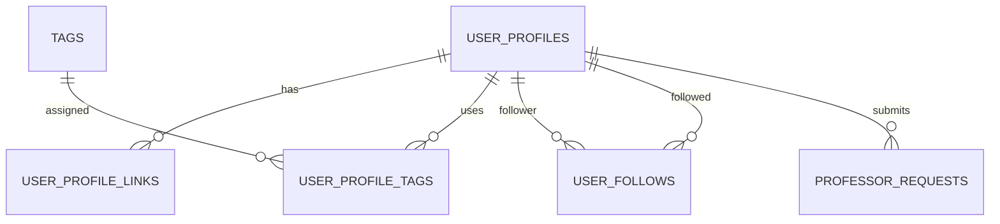
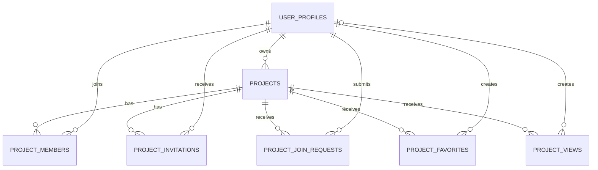
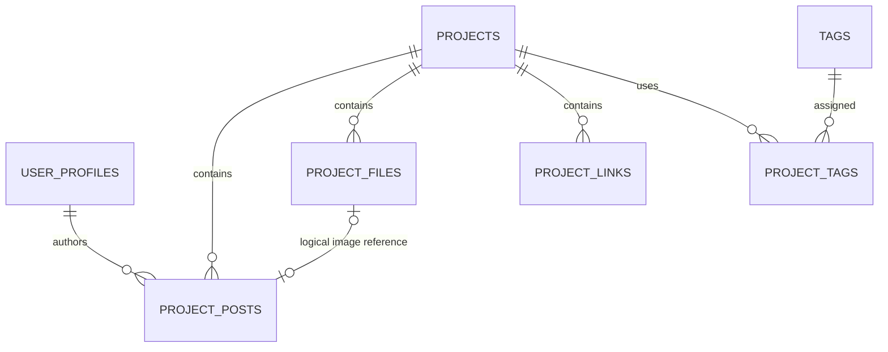
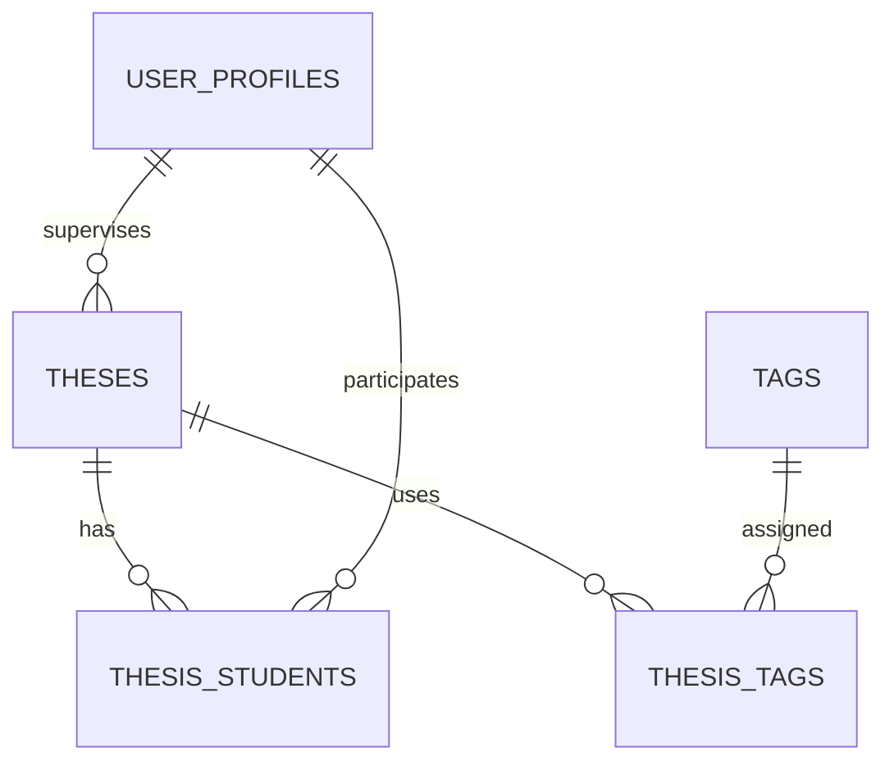
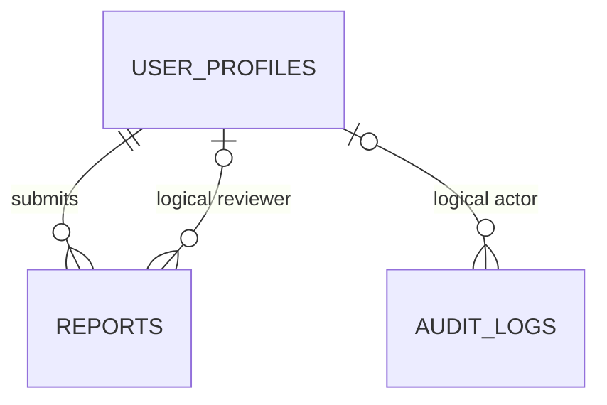
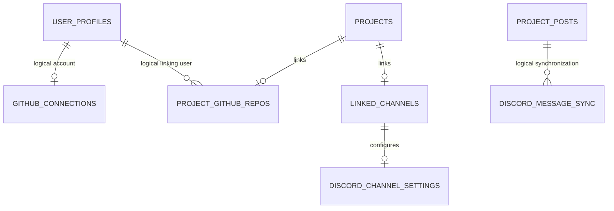

# Database Documentation

This documentation describes the database schema including tables, columns, relationships, keys, constraints and defaults.
The file and image storage is also described here.
## Overview

### Entity Relationship Models
- [Users and Profiles](#users-and-profiles)
- [Projects and Membership](#projects-and-membership)
- [Project Content](#project-content)
- [Theses](#thesis-relationships)
- [Moderation](#moderation-relationships)
- [GitHub and Discord Integrations](#github-and-discord-integrations)

### Tables
#### User Profile
- [User profile](#user_profiles)
- [User profile tags](#user_profile_tags)
- [User profile links](#user_profile_links)
- [User followers](#user_follows)

#### Projects
- [Projects](#projects)
- [Project Posts](#project_posts)
- [Project Invites](#project_invitations)
- [Project Join Requests](#project_join_requests)
- [Project Tags](#project_tags)
- [Project Members](#project_members)
- [Project Favorites](#project_favorites)
- [Project Views](#project_views)
- [Project Files](#project_files)
- [Project Links](#project_links)
#### Tags
- [Tags](#tags)

#### Professor Features
- [Professor Requests](#professor_requests)
- [Theses](#theses)
- [Thesis Tags](#thesis_tags)
- [Thesis Students](#thesis_students)

#### Moderation
- [Reports](#reports)
- [Audit Log](#audit_logs)

#### GitHub integration
- [GitHub Connection](#github_connections)
- [GitHub Project Connection](#project_github_repos)

#### Discord integration
- [Discord linked channels](#linked_channels)
- [Discord channel settings](#discord_channel_settings)
- [Discord message sync](#discord_message_sync)

### Storage
- [Files and image storage](#file-and-image-storage)


## Entity Relationship Models

The database model is divided into several diagrams to keep individual
relationships readable.

Logical references are not enforced through database foreign keys.
Polymorphic references are documented in the corresponding table sections.

### Users and Profiles



### Projects and Membership



### Project Content



### Thesis Relationships



### Moderation Relationships



The following polymorphic target references are not shown as direct
relationships:

- `reports.target_id` is interpreted according to `reports.report_target`.
- `audit_logs.target_id` is interpreted according to
  `audit_logs.target_type`.

### GitHub and Discord Integrations




## Tables

### `user_profiles`
Stores the application profile for a keycloak user. The profile contains public profile data,
moderation status, onboarding state and optional Discord account metadata.

| Column                 |         Type | Null | Constraints/Default | Description                                                          |
|------------------------|-------------:|:----:|---------------------|----------------------------------------------------------------------|
| `keycloak_id`          |         UUID |  no  | PK                  | Keycloak-User-ID                                                     |
| `username`             | varchar(255) |  no  | unique              | Public username                                                      |
| `email`                | varchar(255) | yes  | unique              | E-mail address                                                       |
| `title`                | varchar(255) | yes  | /                   | Optional profile title                                               |
| `location`             | varchar(255) | yes  | /                   | Name of the location                                                 |
| `place_id`             | varchar(255) | yes  | /                   | Google-Places-ID                                                     |
| `followers`            |      integer |  no  | default 0           | Follower count                                                       |
| `about`                |         text | yes  | /                   | Free text biography                                                  |
| `experience`           |         text | yes  | /                   | Free text experience                                                 |
| `is_professor`         |      boolean |  no  | default false       | Marks users as professor that receive professor specific permissions |
| `created_at`           |     datetime |  no  | auto on insert      | Creation timestamp                                                   |
| `updated_at`           |     datetime |  no  | auto on update      | Update timestamp                                                     |
| `status`               |         enum |  no  | default `ACTIVE`    | `ACTIVE` or `BANNED` user status                                     |
| `ban_reason`           |         text | yes  | /                   | Reason for ban                                                       |
| `banned_at`            |     datetime | yes  | /                   | Ban timestamp                                                        |
| `onboarding_completed` |      boolean |  no  | default false       | Tracks whether the user completed the onboarding tutorial            |
| `discord_id`           |  varchar(20) | yes  | unique              | Discord-User-ID                                                      |
| `discord_username`     |  varchar(50) | yes  | /                   | Discord-Username                                                     |
| `discord_avatar`       | varchar(100) | yes  | /                   | Discord-Avatar reference                                             |
| `discord_connected_at` |     datetime | yes  | /                   | Timestamp when the Discord account was connected                     |


### `user_profile_tags`

Join-table for user-profile tags.

| Column                       |        Type | Null | Constraints/Default                 | Description                              |
|------------------------------|------------:|:----:|-------------------------------------|------------------------------------------|
| `user_profile_keycloak_id`   |        UUID |  no  | FK -> `user_profiles.keycloak_id`   | ID of the user profile that uses the tag |
| `tag_name`                   | varchar(30) |  no  | FK -> `tags.name`                   | Name of the tag                          |


### `user_profile_links`

Stores external links shown on the user profile (e.g. GitHub, LinkedIn).

| Column                     |         Type | Null | Constraints/Default                            | Description                                |
|----------------------------|-------------:|:----:|------------------------------------------------|--------------------------------------------|
| `id`                       |         UUID |  no  | PK, generated                                  | Link-ID                                    |
| `user_profile_keycloak_id` |         UUID |  no  | FK -> `user_profiles.keycloak_id`, unique pair | ID of the user profile displaying the link |
| `label`                    | varchar(100) |  no  |                                                | Display name                               |
| `url`                      | varchar(300) |  no  | unique pair                                    | URL                                        |
| `created_at`               |     datetime |  no  | set via `@PrePersist`                          | Creation timestamp                         |
| `updated_at`               |     datetime |  no  | set via `@PreUpdate`                           | Update timestamp                           |

Unique Constraint: `UK_user_profile_links_profile_url(user_profile_keycloak_id, url)`.


### `user_follows`

Stores follow relationships between user profiles.

| Column                  |     Type | Null | Constraints/Default                            | Description                   |
|-------------------------|---------:|:----:|------------------------------------------------|-------------------------------|
| `id`                    |     UUID |  no  | PK, generated                                  | Follow-ID                     |
| `follower_keycloak_id`  |     UUID |  no  | FK -> `user_profiles.keycloak_id`, unique pair | User who follows another user |
| `following_keycloak_id` |     UUID |  no  | FK -> `user_profiles.keycloak_id`, unique pair | User being followed           |
| `created_at`            | datetime |  no  | auto on insert                                 | Follow timestamp              |

Unique Constraint: `(follower_keycloak_id, following_keycloak_id)`.


### `projects`
Stores the project pages. A project can be set to public or private, has one owner,
optional members, posts, links, tags, favorites, views and optional integrations (Discord/GitHub).

| Column                 |         Type | Null | Constraints/Default               | Description                             |
|------------------------|-------------:|:----:|-----------------------------------|-----------------------------------------|
| `id`                   |         UUID |  no  | PK                                | Project-ID                              |
| `name`                 |  varchar(20) |  no  | unique project name               | Project name                            |
| `description`          | varchar(500) | yes  | /                                 | Description                             |
| `short_description`    | varchar(200) | yes  | /                                 | Short description                       |
| `project_url`          |  varchar(30) |  no  | unique `UK_projects_project_url`  | URL-Slug                                |
| `is_private`           |      boolean |  no  | default false                     | Controls whether the project is private |
| `allow_join_requests`  |      boolean |  no  | default true                      | Allow join-requests                     |
| `open_positions_count` |      integer |  no  | default 0                         | Count of open positions                 |
| `delete_at`            |     datetime | yes  | /                                 | Timestamp of soft delete                |
| `owner_keycloak_id`    |         UUID |  no  | FK -> `user_profiles.keycloak_id` | Project owner                           |
| `created_at`           |     datetime |  no  | auto on insert                    | Creation timestamp                      |
| `updated_at`           |     datetime |  no  | auto on update                    | Update timestamp                        |


### `project_posts`

Posts from a project.

| Column               |         Type | Null | Constraints/Default                     | Description                      |
|----------------------|-------------:|:----:|-----------------------------------------|----------------------------------|
| `id`                 |         UUID |  no  | PK, generated                           | Post-ID                          |
| `project_id`         |         UUID |  no  | FK -> `projects.id`                     | Project-ID                       |
| `author_keycloak_id` |         UUID |  no  | FK -> `user_profiles.keycloak_id`       | Author                           |
| `title`              | varchar(255) |  no  | /                                       | Title                            |
| `content`            | varchar(255) |  no  | /                                       | Content                          |
| `status`             |         enum |  no  | default `DRAFT`                         | `ARCHIVED`, `DRAFT`, `PUBLISHED` |
| `content_format`     |         enum |  no  | default `PLAIN_TEXT`                    | `MARKDOWN`, `PLAIN_TEXT`         |
| `published_at`       |     datetime | yes  | /                                       | Publish timestamp                |
| `archived_at`        |     datetime | yes  | /                                       | Archive timestamp                |
| `created_at`         |     datetime |  no  | auto on insert                          | Creation timestamp               |
| `updated_at`         |     datetime |  no  | auto on update                          | Update timestamp                 |
| `image_url`          | varchar(255) | yes  | /                                       | URL of the image                 |
| `image_file_id`      |         UUID | yes  | logical reference -> `project_files.id` | ID of the uploaded file          |


### `project_invitations`

Project invites from the project owner to a user.

| Column            |         Type | Null | Constraints/Default                              | Description                       |
|-------------------|-------------:|:----:|--------------------------------------------------|-----------------------------------|
| `id`              |         UUID |  no  | PK, generated                                    | Invite-ID                         |
| `project_id`      |         UUID |  no  | FK -> `projects.id`, unique triple               | Project-ID                        |
| `invited_user_id` |         UUID |  no  | FK -> `user_profiles.keycloak_id`, unique triple | ID of the invited user            |
| `message`         | varchar(500) | yes  | /                                                | Optional invite message           |
| `created_at`      |     datetime |  no  | set via `@PrePersist`                            | Creation timestamp                |
| `updated_at`      |     datetime |  no  | set via `@PreUpdate`                             | Update timestamp                  |
| `status`          |         enum |  no  | /                                                | `ACCEPTED`, `REJECTED`, `PENDING` |

Unique Constraint: `UK_invitations_project_user_status(project_id, invited_user_id, status)`.

### `project_join_requests`

Join-requests from a user to a project.

| Column               |         Type | Null | Constraints/Default                              | Description                       |
|----------------------|-------------:|:----:|--------------------------------------------------|-----------------------------------|
| `id`                 |         UUID |  no  | PK, generated                                    | Join-request-ID                   |
| `project_id`         |         UUID |  no  | FK -> `projects.id`, unique triple               | Project-ID                        |
| `requesting_user_id` |         UUID |  no  | FK -> `user_profiles.keycloak_id`, unique triple | Requesting User-ID                |
| `message`            | varchar(500) | yes  |                                                  | Optional request message          |
| `created_at`         |     datetime |  no  | set via `@PrePersist`                            | Creation timestamp                |
| `updated_at`         |     datetime |  no  | set via `@PreUpdate`                             | Update timestamp                  |
| `status`             |         enum |  no  | default `PENDING`                                | `PENDING`, `ACCEPTED`, `REJECTED` |

Unique Constraint: `UK_join_requests_project_user_status(project_id, requesting_user_id, status)`.

### `project_favorites`

Favorite projects. Users can add a project as a favorite.

| Column             |     Type | Null | Constraints/Default                            | Description        |
|--------------------|---------:|:----:|------------------------------------------------|--------------------|
| `id`               |     UUID |  no  | PK, generated                                  | Favorite-ID        |
| `user_keycloak_id` |     UUID |  no  | FK -> `user_profiles.keycloak_id`, unique pair | ID of the user     |
| `project_id`       |     UUID |  no  | FK -> `projects.id`, unique pair               | ID of the project  |
| `created_at`       | datetime |  no  | auto on insert                                 | Creation timestamp |

Unique Constraint: `(user_keycloak_id, project_id)`.

### `project_views`

Views on a project. 

| Column             |     Type | Null | Constraints/Default               | Description                   |
|--------------------|---------:|:----:|-----------------------------------|-------------------------------|
| `id`               |     UUID |  no  | PK, generated                     | View-ID                       |
| `project_id`       |     UUID |  no  | FK -> `projects.id`               | ID of the viewed project      |
| `user_keycloak_id` |     UUID | yes  | FK -> `user_profiles.keycloak_id` | ID of the authentication user |
| `viewed_at`        | datetime |  no  | auto on insert                    | View timestamp                |


### `project_files`

Uploaded files of a project.

| Column          |         Type | Null | Constraints/Default   | Description                     |
|-----------------|-------------:|:----:|-----------------------|---------------------------------|
| `id`            |         UUID |  no  | PK, generated         | File-ID                         | 
| `project_id`    |         UUID |  no  | FK -> `projects.id`   | Project-ID                      |
| `original_name` | varchar(255) |  no  | /                     | Original file name              |
| `storage_name`  | varchar(255) |  no  | unique                | Name of the file in the storage |
| `mime_type`     | varchar(100) |  no  | /                     | MIME-Type                       |
| `size_bytes`    |       bigint |  no  | /                     | File size                       |
| `created_at`    |     datetime |  no  | set via `@PrePersist` | Upload timestamp                |
| `visibility`    |         enum |  no  | default `PUBLIC`      | `PRIVATE`, `PUBLIC`, `INTERNAL` |

### `project_links`

Published links on a project.

| Column       |         Type | Null | Constraints/Default              | Description         |
|--------------|-------------:|:----:|----------------------------------|---------------------|
| `id`         |         UUID |  no  | PK, generated                    | Link-ID             |
| `project_id` |         UUID |  no  | FK -> `projects.id`, unique pair | Project-ID          |
| `label`      | varchar(100) |  no  |                                  | Display name        |
| `url`        | varchar(300) |  no  | unique pair                      | URL                 |
| `created_at` |     datetime |  no  | set via `@PrePersist`            | Creation timestamp  |
| `updated_at` |     datetime |  no  | set via `@PreUpdate`             | Update timestamp    |
| `visibility` |         enum |  no  | default `PUBLIC`                 | `PRIVATE`, `PUBLIC` |

Unique Constraint: `UK_project_links_project_url(project_id, url)`.


### `project_tags`
Join-table for project tags.

| Column         |        Type | Null | Constraints/Default | Description       |
|----------------|------------:|:----:|---------------------|-------------------|
| `project_id`   |        UUID |  no  | FK -> `projects.id` | ID of the project |
| `tag_name`     | varchar(30) |  no  | FK -> `tags.name`   | Name of the tag   |


### `project_members`
Join-table for project members.

| Column                     |    Type | Null | Constraints/Default               | Description            |
|----------------------------|--------:|:----:|-----------------------------------|------------------------|
| `project_id`               |    UUID |  no  | FK -> `projects.id`               | ID of the project      |
| `user_profile_keycloak_id` |    UUID |  no  | FK -> `user_profiles.keycloak_id` | ID of the user profile |

Unique Constraint: `UK_project_members(project_id, user_profile_keycloak_id)`.


### `tags`
Tag table.

| Column   |          Type | Null | Constraints/Default | Description |
|----------|--------------:|:----:|---------------------|-------------|
| `name`   |   varchar(30) |  no  | PK                  | Tag-name    |


### `professor_requests`

Request for professor rights.

| Column                    |          Type | Null | Constraints/Default                  | Description                                                                |
|---------------------------|--------------:|:----:|--------------------------------------|----------------------------------------------------------------------------|
| `id`                      |          UUID |  no  | PK, generated                        | Request-ID                                                                 |
| `requesting_user_id`      |          UUID |  no  | FK -> `user_profiles.keycloak_id`    | User-ID of the requestor                                                   |
| `email`                   |  varchar(255) |  no  | /                                    | Verification-E-Mail                                                        |
| `email_verified_at`       |      datetime | yes  | /                                    | Verification timestamp                                                     |
| `verification_expires_at` |      datetime | yes  | /                                    | Token expiration timestamp                                                 |
| `verification_token_hash` |  varchar(255) | yes  | /                                    | Hash of the token                                                          |
| `text`                    | varchar(1000) |  no  | /                                    | Reason why the requestor should receive professor rights.                  |
| `created_at`              |      datetime |  no  | set via `@PrePersist`                | Creation timestamp                                                         |
| `updated_at`              |      datetime |  no  | set via `@PreUpdate`                 | Update timestamp                                                           |
| `status`                  |          enum |  no  | default `WAITING_EMAIL_VERIFICATION` | `WAITING_EMAIL_VERIFICATION`, `PENDING`, `ACCEPTED`, `REJECTED`, `EXPIRED` |


### `theses`

Thesis.

| Column                   |          Type | Null | Constraints/Default               | Description           |
|--------------------------|--------------:|:----:|-----------------------------------|-----------------------|
| `id`                     |          UUID |  no  | PK                                | Thesis-ID             |
| `title`                  |  varchar(100) |  no  | unique `UK_theses_title`          | Title                 |
| `thesis_url`             |   varchar(30) |  no  | unique `UK_theses_thesis_url`     | URL-Slug              |
| `description`            | varchar(2000) | yes  | /                                 | Description           |
| `short_description`      |  varchar(300) | yes  | /                                 | Short description     |
| `supervisor_keycloak_id` |          UUID |  no  | FK -> `user_profiles.keycloak_id` | Supervising professor |
| `created_at`             |      datetime |  no  | auto on insert                    | Creation timestamp    |
| `updated_at`             |      datetime |  no  | auto on update                    | Update timestamp      |

### `thesis_tags`

Join-table for thesis tags.

| Column        |        Type | Null | Constraints/Default | Description        |
|---------------|------------:|:----:|---------------------|--------------------|
| `thesis_id`   |        UUID |  no  | FK -> `theses.id`   | ID of the thesis   |
| `tag_name`    | varchar(30) |  no  | FK -> `tags.name`   | Tag name           |

### `thesis_students`

Join-table for students of a thesis.

| Column                     | Type | Null | Constraints/Default                            | Description       |
|----------------------------|-----:|:----:|------------------------------------------------|-------------------|
| `thesis_id`                | UUID |  no  | FK -> `theses.id`, unique pair                 | ID of the thesis  |
| `user_profile_keycloak_id` | UUID |  no  | FK -> `user_profiles.keycloak_id`, unique pair | ID of the student |

Unique Constraint: `UK_thesis_students(thesis_id, user_profile_keycloak_id)`.


### `reports`

Reports for moderation purpose. 

| Column                 |         Type | Null | Constraints/Default               | Description                                  |
|------------------------|-------------:|:----:|-----------------------------------|----------------------------------------------|
| `id`                   |         UUID |  no  | PK, generated                     | Report-ID                                    |
| `reporter_id`          |         UUID |  no  | FK -> `user_profiles.keycloak_id` | Reporting User-ID                            |
| `report_target`        |         enum |  no  | length 64                         | `USER`, `PROJECT`, `PROJECT_POST`            |
| `target_id`            |         UUID |  no  | polymorphic reference             | Target ID for the specified `report_target`  |
| `report_reason`        |         enum |  no  | length 64                         | See enum below                               |
| `message`              |         text | yes  |                                   | Text of the reporting user                   |
| `report_status`        |         enum |  no  | default `OPEN`, length 32         | `OPEN`, `IN_REVIEW`, `RESOLVED`, `DISMISSED` |
| `reviewer_keycloak_id` |         UUID | yes  | logical user-reference            | Moderator-ID                                 |
| `reviewer_username`    | varchar(255) | yes  |                                   | Moderator-Username                           |
| `reviewed_at`          |     datetime | yes  |                                   | Review timestamp                             |
| `moderator_message`    |         text | yes  |                                   | Internal moderation note                     |
| `created_at`           |     datetime |  no  | set via `@PrePersist`             | Creation timestamp                           |
| `updated_at`           |     datetime |  no  | set via `@PreUpdate`              | Update timestamp                             |

`report_reason`: `SPAM`, `HARASSMENT`, `HATE_SPEECH`, `INAPPROPRIATE_CONTENT`, `VIOLENCE_OR_THREATS`, `SELF_HARM_OR_SUICIDE`, 
`PERSONAL_DATA`, `COPYRIGHT`, `MISINFORMATION`, `FRAUD_OR_IMPERSONATION`, `OTHER`.

### `audit_logs`

Audit-log for moderation purpose.

| Column           |          Type | Null | Constraints/Default    | Description                     |
|------------------|--------------:|:----:|------------------------|---------------------------------|
| `id`             |          UUID |  no  | PK, generated          | Audit-ID                        |
| `action`         |          enum |  no  | length 80              | Performed action                |
| `actor_user_id`  |          UUID |  no  | logical user-reference | Performing User-ID              |
| `actor_username` |  varchar(255) | yes  |                        | Username of the performing user |
| `actor_email`    |  varchar(255) | yes  |                        | E-mail of the performing user   |
| `target_type`    |          enum |  no  | length 80              | Target type                     |
| `target_id`      |          UUID |  no  | polymorphic reference  | Target-ID                       |
| `target_name`    |  varchar(255) | yes  |                        | Target name                     |
| `details`        | varchar(2000) | yes  |                        | Details                         |
| `created_at`     |      datetime |  no  | auto on insert         | Creation timestamp              |

`action`: `PROJECT_DELETED`, `PROJECT_POST_DELETED`, `USER_BANNED`, `USER_UNBANNED`, `PROFESSOR_REQUEST_ACCEPTED`, `PROFESSOR_REQUEST_REJECTED`.  
`target_type`: `PROJECT`, `PROJECT_POST`, `USER`, `PROFESSOR_REQUEST`.

### `github_connections`

One connected GitHub account per user profile.

| Column                   |         Type | Null | Constraints/Default                                  | Description           |
|--------------------------|-------------:|:----:|------------------------------------------------------|-----------------------|
| `keycloak_id`            |         UUID |  no  | PK, logical reference -> `user_profiles.keycloak_id` | User-ID               |
| `github_user_id`         |       bigint |  no  | /                                                    | GitHub-User-ID        |
| `github_login`           | varchar(100) |  no  | /                                                    | GitHub-Login          |
| `avatar_url`             | varchar(300) | yes  | /                                                    | Avatar-URL            |
| `encrypted_access_token` | varchar(512) |  no  | /                                                    | Encrypted OAuth-Token |
| `scopes`                 | varchar(200) | yes  | /                                                    | OAuth-Scopes          |
| `status`                 |         enum |  no  | default `ACTIVE`                                     | `ACTIVE`, `INVALID`   |
| `created_at`             |     datetime |  no  | auto on insert                                       | Creation timestamp    |
| `updated_at`             |     datetime |  no  | auto on update                                       | Update timestamp      |

### `project_github_repos`

GitHub-Repository linking to project.

| Column                      |         Type | Null | Constraints/Default                              | Description                 |
|-----------------------------|-------------:|:----:|--------------------------------------------------|-----------------------------|
| `id`                        |         UUID |  no  | PK, generated                                    | Link-ID                     |
| `project_id`                |         UUID |  no  | FK -> `projects.id`, unique                      | Project-ID                  |
| `repo_owner`                | varchar(100) |  no  | /                                                | Repository-Owner            |
| `repo_name`                 | varchar(150) |  no  | /                                                | Repository-Name             |
| `linked_by_keycloak_id`     |         UUID |  no  | logical reference -> `user_profiles.keycloak_id` | Linking user profile        |
| `default_branch`            | varchar(255) | yes  | /                                                | Default-Branch              |
| `show_readme`               |      boolean |  no  | default false                                    | Shows README                |
| `auto_invite_collaborators` |      boolean |  no  | default false                                    | Auto-Invite project members |
| `created_at`                |     datetime |  no  | auto on insert                                   | Creation timestamp          |

### `linked_channels`

Discord-channel linking to project.

| Column               |         Type | Null | Constraints/Default                                      | Description         |
|----------------------|-------------:|:----:|----------------------------------------------------------|---------------------|
| `id`                 |         UUID |  no  | PK, generated                                            | Link-ID             |
| `project_id`         |         UUID |  no  | FK -> `projects.id`, unique `UK_linked_channels_project` | Project-ID          |
| `discord_channel_id` |  varchar(20) |  no  | /                                                        | Discord-Channel-ID  |
| `discord_guild_id`   |  varchar(20) | yes  | /                                                        | Discord-Guild-ID    |
| `discord_invite_url` | varchar(255) | yes  | /                                                        | Discord Invite link |
| `is_active`          |      boolean |  no  | default true                                             | Active connection   |
| `created_at`         |     datetime |  no  | auto on insert                                           | Creation timestamp  |
| `updated_at`         |     datetime |  no  | auto on update                                           | Update timestamp    |

### `discord_channel_settings`

Notification settings for a linked channel.

| Column                |     Type | Null | Constraints/Default                                                   | Description                    |
|-----------------------|---------:|:----:|-----------------------------------------------------------------------|--------------------------------|
| `id`                  |     UUID |  no  | PK, generated                                                         | Settings-ID                    |
| `linked_channel_id`   |     UUID |  no  | FK -> `linked_channels.id`, unique `UK_discord_channel_settings_link` | Discord-Link                   |
| `notify_post_created` |  boolean |  no  | default true                                                          | Notify on new post             |
| `notify_post_updated` |  boolean |  no  | default true                                                          | Notify on updated post         |
| `notify_post_deleted` |  boolean |  no  | default false                                                         | Notify on post delete          |
| `notify_member_join`  |  boolean |  no  | default true                                                          | Notify on project member join  |
| `notify_member_leave` |  boolean |  no  | default false                                                         | Notify on project member leave |
| `created_at`          | datetime |  no  | auto on insert                                                        | Creation timestamp             |
| `updated_at`          | datetime |  no  | auto on update                                                        | Update timestamp               |

### `discord_message_sync`

Mapping between project posts and discord messages.

| Column               |        Type | Null | Constraints/Default                          | Description                                  |
|----------------------|------------:|:----:|----------------------------------------------|----------------------------------------------|
| `id`                 |        UUID |  no  | PK, generated                                | Sync-ID                                      |
| `platform_post_id`   |        UUID |  no  | logical reference -> `project_posts.id`      | Project-Post                                 |
| `discord_message_id` | varchar(20) |  no  | unique `UK_discord_message_sync_discord_msg` | Discord-Message-ID                           |
| `discord_channel_id` | varchar(20) |  no  |                                              | Discord-Channel-ID                           |
| `discord_guild_id`   | varchar(20) | yes  |                                              | Discord-Guild-ID                             |
| `direction`          |        enum |  no  | default `PLATFORM_TO_DISCORD`, length 10     | `PLATFORM_TO_DISCORD`, `DISCORD_TO_PLATFORM` |
| `synced_at`          |    datetime |  no  | auto on insert                               | Sync timestamp                               |


## File and image storage
Binary files and images are stored on the application server's file system, not
in the database. The storage directory is configured through
`app.uploads.dir` and defaults to:

```text
./uploads
```

The `project_files` table stores the corresponding metadata. Its
`storage_name` identifies the binary file inside the configured upload directory:

```text
${app.uploads.dir}/<storage_name>
```

Project-post images use the same storage mechanism. Their metadata is stored as
an `INTERNAL` record in `project_files`, while `project_posts.image_file_id` contains a logical reference to that record.
`project_posts.image_url` contains the API path used to retrieve the image.
